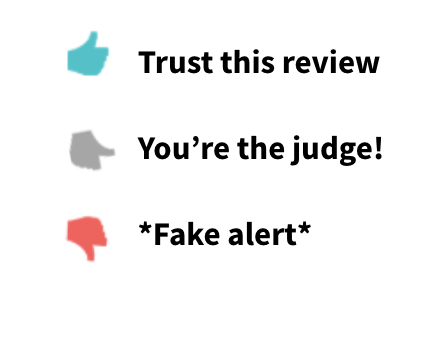

# FakeFactChromeExtension
**IDEA** 
- I have developed a machine learning model that is able to detect fake and authentic reviews patterns on Sephora.com so I am working towards deploying the model through Google Chrome Extension. Project is currently in progress. (link to the machine learning model project github.com/suchayarj/WhatsOnYourFace...FakeOrFact)
- After users download the 'Fake or Fact' Google Chrome Extension, the extension will work automatically whenever they access Sephora.com. When they access a product link, they will see a badge right next to each review indicating if the review is *Fake*, *Border Line Fake*, or *Authentic*.

Please see an example of the user interface below:
 

    
    
    

 

